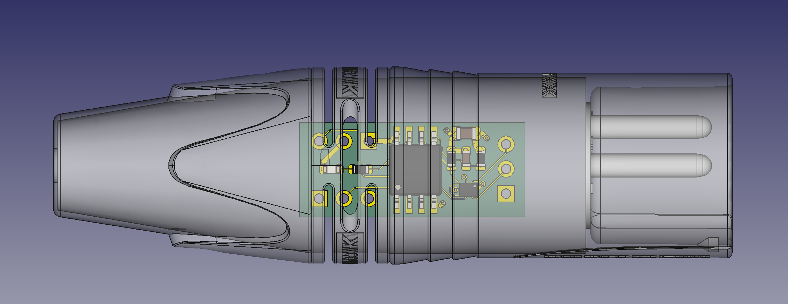
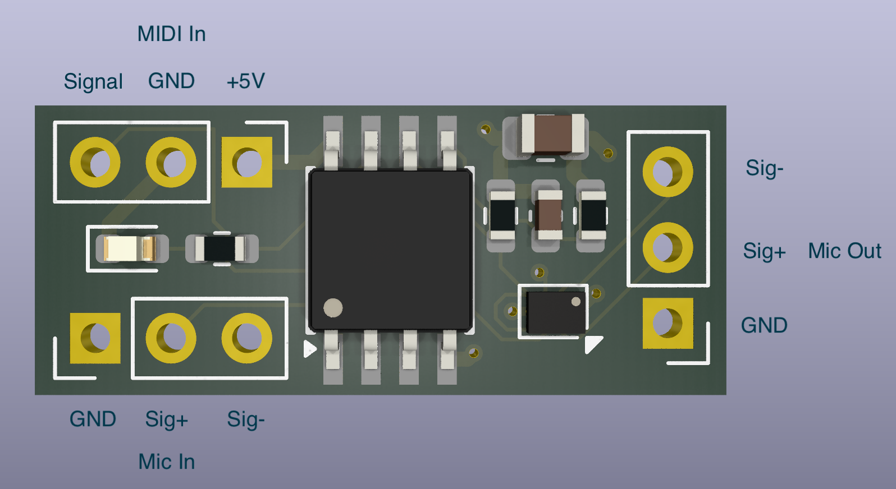

# Midi Microphone Muter

This repository provides code and hardware for a little tool in the form of a Y-adapter to be used on stage to mute a single microphone by receiving a MIDI control change signal.

## Motivation

For me as a drummer doing some additional background vocals in my band, there is always the problem of cymbal bleed on the vocal microphone signal. So while I was not singing, our live mixing engineer used to turn down the volume of my microphone signal at the risk of not having it back when needed again. Since a MIDI track was already running synchronized with our show for controlling lights and guitar effects, our mixing engineer Jakob had the idea to also use the MIDI signal to mute the microphone in those parts of the songs where it is not needed. However, all available solutions were not at all compact and satisfying, so I decided to build my own device.

## How it works

The electronics pcb is designed to fit into an XLR cable connector. This way the full device is nothing more than a Y-shaped cable with two connectors on the input side (Mic and MIDI In) and one XLR connector on the output side to deliver the occasionally muted signal to the microphone preamp.

Inspired by another blog post (https://mitxela.com/projects/midi_on_the_attiny), I decided to use the 5V power line from MIDI to power an ATtiny85 which decodes the serial MIDI data and pulls outputs high for an LED and an analog switch to turn the audio off.

Contrary to the popular advice, no optocoupler was used on the receiving unit to save space and allow to directly use MIDI as a voltage source. Pros and cons of this approach are described in detail in the link above.

Another variant of the device having the electronics mounted into a separate small box is currently in the planning phase. This would allow for proper MIDI decoupling, provide an additional MIDI Out connector and XLR connectors to make it more modular and independent of the needed cable lengths. On the downside, this would take a little more space and require another voltage source (battery, 5V connector or using microphone phantom power).

## Hardware

PCB dimensions are 23.15x9.70 mm and therefore it fits nicely into a standard XLR connector. On the input side, there are pin header terminals for MIDI In (GND, +5V, Signal) and Mic In (analog GND, Signal +, Signal -). On the output side, there is an additional Mic Out 3-pin terminal. The ATtiny85 is a cheap microcontroller which can be run without any peripherals at low power, which makes it the perfect choice for processing the program logic. TS5A22364 from Texas Instruments is a 2-channel analog switch with negative signaling capability, perfectly suited for audio switching. It takes audio Signal + and Signal - on its normally closed inputs and is connected to Mic Out on its common output pins. The only additional elements on the PCB are a 33 uF capacitor for smoothing the input voltage, a pull-up resistor and a small stabilizing 1nF capacitor on the MIDI signal line, a pull-down resistor on the output line of the ATtiny85 connecting to the analog switch and an optional LED with serial resistor to visualize when the device is in mute mode (mainly for testing).

Because audio signals are connected to the normally closed pins of the analog switch, the default behavior is to let the audio flow from input to output and only mute it on respective incoming MIDI commands. But keep in mind there is no real bypass, so MIDI has to be connected (and powered) to let audio go through.

Analog (audio) GND is not connected to the digital GND by default. During tests, it was found that the two should be connected to avoid noise on the audio output, but this can easily be achieved by adding an additional cable between the respective pins.

You need to install KiCad (https://www.kicad.org) to be able to open the schematics / pcb / gerber files.

## Software

On the software side, I used a slightly modified version of Nick Gammon's MIDI decoder for ATtiny85 (https://arduino.stackexchange.com/questions/14054/interfacing-an-attiny85-with-midi-via-software-serial?answertab=active#tab-top). I just added the output switching logic when a control change command is received on the specified MIDI channel and CC number (by default: CC 63 on MIDI channel 7).

For programming the ATtiny85, Arduino IDE was used in combination with an Arduino nano as programmer. The procedure is described elsewhere in detail. I followed the description in this link: https://wolles-elektronikkiste.de/en/programming-attiny-with-arduino-code

You need to install Arduino IDE (https://www.arduino.cc/en/software) to be able use the included software.

## Usage

Connect microphone, MIDI in and microphone preamp. By default, the signal will be hearable. Sending CC 63 on MIDI channel 7 with a value between than 64 and 127 will mute the microphone and light up the LED. Another event with a value between 0 and 63 will unmute the line again.

## How to get it

Currently, I'm not planning to sell ready-to-use hardware. But I have some PCBs over that I don't need, so feel free to contact me if interested. Otherwise, everyone is invited to build the device on her / his own. Everything you need should be in the repository. If you have problems or questions, do not hesitate to ask.

## Feedback

Any feedback is appreciated, either on making the device more robust while maintaining the small footprint, or if there are any tips on implementing the in-a-box design. Also, please report any bugs in case you find some.